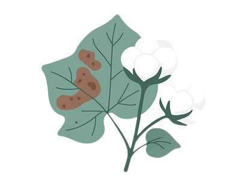

# 🌱 Cotton Disease Detection System

<div align="center">



**AI-Powered Cotton Plant Disease Detection using Deep Learning (Optimized with TFLite)**

[](https://python.org)
[](https://flask.palletsprojects.com/)
[](https://tensorflow.org/lite)
[](LICENSE)

</div>

---

## 🌟 Overview

The **Cotton Disease Detection System** is a state-of-the-art AI-powered web application designed to help farmers and agricultural experts identify diseases in cotton plants instantly. By leveraging **Deep Learning (ResNet-50)**, the system analyzes leaf images to provide accurate diagnosis and treatment recommendations.

## ✨ Key Features

*   **ResNet-50 (TFLite)**: Optimized deep learning architecture for lightning-fast disease classification.
*   **Lightweight Deployment**: Specifically designed to run efficiently on cloud platforms like PythonAnywhere.
*   **Real-time Prediction**: Instant results with confidence scores and low latency.
*   **5 Major Diseases**: Detects Aphids, Army Worm, Bacterial Blight, Powdery Mildew, and Target Spot.

### 🤖 Smart Assistant
*   **AI Chatbot**: Get instant answers to your farming questions and disease management tips.

### 👥 Community & Collaboration
*   **Farmers Forum**: A dedicated space for farmers to share knowledge, discuss crop health, and seek advice.

### 📊 Professional Reporting
*   **PDF Reports**: Generate and download detailed diagnostic reports for record-keeping and sharing with experts.
*   **Prediction History**: Registered users can track all their previous scans in a personal dashboard.

## 🛠 Technology Stack

*   **Backend**: Flask (Python)
*   **AI/ML**: TensorFlow Lite (TFLite), ResNet-50, OpenCV, NumPy
*   **Database**: SQLite / MySQL (SQLAlchemy)
*   **Frontend**: HTML5, CSS3 (Professional UI), Bootstrap 5, Remix Icons
*   **Animations**: AOS (Animate On Scroll)

## 🚀 Installation & Setup

### Prerequisites
*   Python 3.10+
*   Git & Git LFS

### Step 1: Clone the Repository
```bash
git clone https://github.com/Farhani981/Cotton-Disease-Detection-main.git
cd Cotton-Disease-Detection-main
```

### Step 2: Virtual Environment
```bash
python -m venv venv
# Windows
venv\Scripts\activate
# Linux/Mac
source venv/bin/activate
```

### Step 3: Install Dependencies
```bash
pip install -r requirements.txt
```

### Step 4: Run the App
```bash
python app.py
```
Visit `http://127.0.0.1:5000` in your browser.

## 📸 Project Showcase
The application features a modern, responsive "Glassmorphism" UI design, ensuring a premium experience on both desktop and mobile devices.

---

<div align="center">

**Developed by Farhani981**  
*Advancing Agriculture through Artificial Intelligence*

[⬆ Back to Top](#-cotton-disease-detection-system)

</div>
